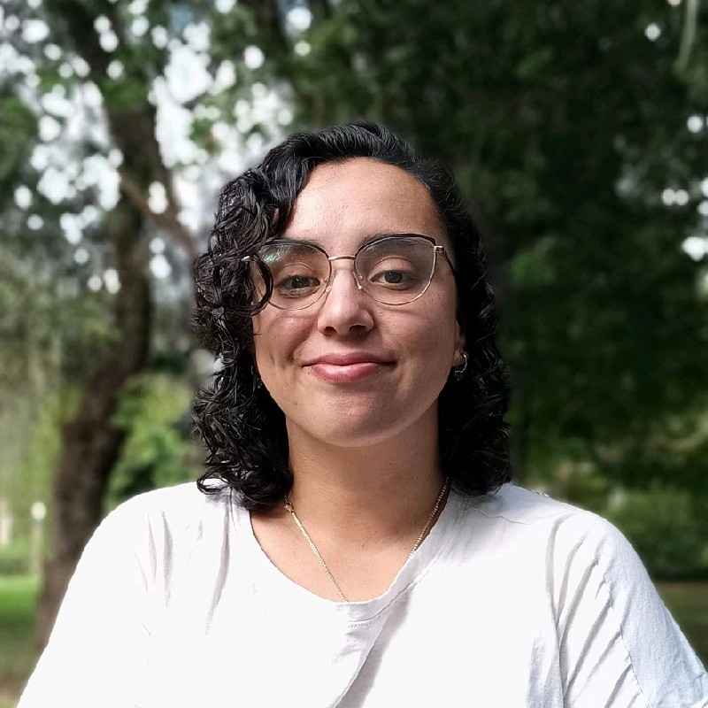

## **Código de conducta** {.30-70-light}

 
 
 

::: incremental
-   🛡️ Todos los espacios de participación R en Buenos Aires, se rigen por el Código de Conducta, ya sean conferencia, charla, taller, reunión, redes sociales y otros medios en línea. Conoce el [Código de conducta de R en Buenos Aires](https://renbaires.github.io/cdc)

-   🌈 Nuestro objetivo es que disfrutes este espacio. Si algo no está bien, contactate con el equipo coordinador o escribí un mail a renbaires@gmail.com
:::

## Comunidad R {.30-70-white}

 

### Nuestra misión

  

Este grupo surge con la misión de **conectar a quienes usan el lenguaje de programación R** en Buenos Aires, independientemente de su grado de conocimiento y el ámbito de aplicación del mismo.

El **objetivo** es *promover el uso R, el aprendizaje continuo y favorecer la creación de proyectos interdisciplinarios*.

## Organizan este encuentro {.content-light}

  
  
 

::: columns

::: {.column width="33%"}
{width="50%" style="border-radius: 80%;"}

[**Andrea Gomez Vargas**](https://github.com/SoyAndrea)
:::

::: {.column width="33%"}
{width="50%" style="border-radius: 80%;"}

[**Ariana Bardauil**](https://github.com/ariibard)
:::

::: {.column width="33%"}
{width="50%" style="border-radius: 80%;"}

[**Emanuel Ciardullo**](https://github.com/ECiardullo)

:::
:::

## **Ariana Bardauil** {.content-light .smaller}

::::: columns

::: {.column width="30%"}

 

{width="65%" style="border-radius: 50%;"}
:::

::: {.column width="3%"}

::: 

::: {.column width="62%"}
 
Es politóloga (UNLaM) especializada en ciencia de datos, con formación de posgrado en estadística. Actualmente se desempeña como analista de datos en el Ministerio de Salud del Gobierno de la Ciudad de Buenos Aires, combinando programación en R, Python y SQL para el procesamiento de información, la automatización de reportes y el desarrollo de visualizaciones y aplicaciones interactivas. 

Además, es docente universitaria, coordina el Núcleo de Innovación Social (NIS) y es organizadora de la comunidad R en Buenos Aires.

:::

:::::

##  {.toc-people-dark}

 
 

::: largest
Bienvenides!
:::
